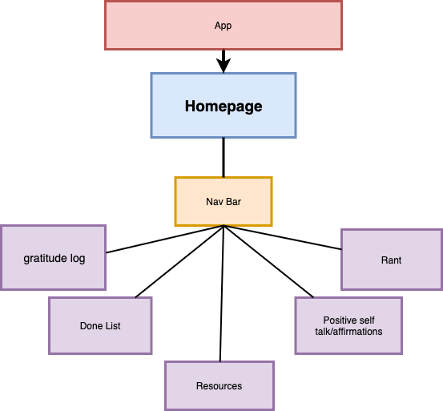

# Project Overview

## Project Name

Mental Help!

## Project Description

Mental Help is a website that allows you to log your feelings and cope with your emotions just like a bullet journal but digital. Keeping a journal is a good way to track your moods, energy levels, and mental health symptoms. Over time, journaling these things might help you recognize things that trigger depression and anxiety.

## Wireframes

[a link](https://www.figma.com/file/ucVN5TcRE0xTE0eBdLH8Jx/Untitled?node-id=0%3A1)

## Component Hierarchy



## API and Data Sample

Using Airtable API

```
{
"records": [
{
"id": "recIXLYrBuaHEEEYM",
"fields": {
"gratitudeLog": "I'm grateful for my life"
},
"createdTime": "2020-10-09T01:12:05.000Z"
},
{
"id": "reccIZe3RDWN3t0Fg",
"fields": {
"gratitudeLog": "I'm grateful for having a roof over my"
},
"createdTime": "2020-10-09T01:12:05.000Z"
},
{
"id": "recPznvMRIAXENKDe",
"fields": {},
"createdTime": "2020-10-09T01:12:05.000Z"
}
],
"offset": "recPznvMRIAXENKDe"
}
```

### MVP/PostMVP

#### MVP

- Create HomePage with a Button to start
- Make the Gratitude log page and render the data from user input to the page
- Make the Resources page

#### PostMVP

- Add a responsive NavBar
- Add more pages to render user input in different categories using different airtable's APIs
- Add different animations

## Project Schedule

| Day           | Deliverable                                        | Status     |
| ------------- | -------------------------------------------------- | ---------- |
| October 8     | Prompt / Wireframes / Priority Matrix / Timeframes | Incomplete |
| October 9     | Project Approval / Initial structure               | Incomplete |
| October 10/11 | Welcome page and button animation                  | Incomplete |
| October 12    | Gratitude page and API render                      | Incomplete |
| October 13    | CSS and style of MVP                               | Incomplete |
| October 14/15 | reach MVP and start working on Post MVP            | Incomplete |
| October 16    | Presentations                                      | Incomplete |

## Timeframes

Tell us how long you anticipate spending on each area of development. Be sure to consider how many hours a day you plan to be coding and how many days you have available until presentation day.

Time frames are also key in the development cycle. You have limited time to code all phases of the game. Your estimates can then be used to evalute game possibilities based on time needed and the actual time you have before game must be submitted. It's always best to pad the time by a few hours so that you account for the unknown so add and additional hour or two to each component to play it safe. Throughout your project, keep track of your Time Invested and Actual Time and update your README regularly.

| Component             | Priority | Estimated Time | Time Invested | Actual Time |
| --------------------- | :------: | :------------: | :-----------: | :---------: |
| Creating HomePage     |    H     |      3hrs      |               |             |
| HomePage Button       |    H     |      1hr       |               |             |
| Creating Grat. Page   |    H     |      3hrs      |               |             |
| Add input form        |    H     |      3hrs      |               |             |
| Render API data       |    H     |      3hrs      |               |             |
| Create resources page |    H     |      2hrs      |               |             |
| Style MVP pages       |    H     |      3hrs      |               |             |
| Add animations        |    M     |      3hrs      |               |             |
| Create post MVP pages |    M     |      6hrs      |               |             |
| Render more APIs      |    M     |      6hrs      |               |             |
| Add info about me     |    L     |      2hrs      |               |             |
| Add animations        |    L     |      3hrs      |               |             |
| Total                 |    H     |     38hrs      |               |             |

## SWOT Analysis

### Strengths:

### Weaknesses:

### Opportunities:

### Threats:
